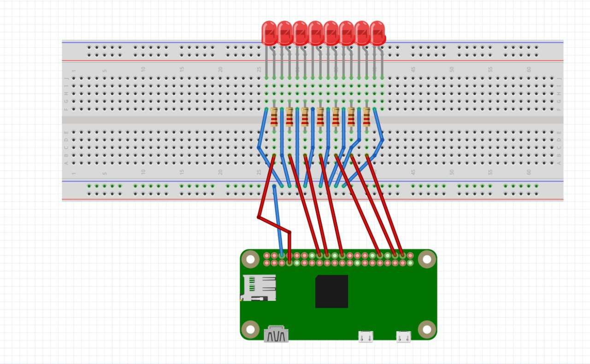

## Raspberry Pi eight LED modes

[](https://travis-ci.org/miskopo/pi_eight_leds)
[](https://codecov.io/gh/miskopo/pi_eight_leds)
[](https://requires.io/github/miskopo/pi_eight_leds/requirements/?branch=master)
[](LICENSE)


### Requirements: :airplane:
This program contains several lighting modes using Raspberry Pi (any type, but tested on Zero) and is designed for following connection:



### Modes (list is not yet complete) :construction:
- [x] allon - Turns all LEDs on

    :red_circle::red_circle: :red_circle: :red_circle: :red_circle: :red_circle: :red_circle: :red_circle:
    
- [x] alloff  - Turns all LEDs off (used mostly in testing)

    :black_circle: :black_circle: :black_circle: :black_circle: :black_circle: :black_circle: :black_circle: :black_circle: 
    
- [x] kitt - Lights LEDs from center to the edges like in Knight Rider

    :black_circle: :black_circle: :black_circle: :red_circle: :red_circle: :black_circle: :black_circle: :black_circle: 
    
    :black_circle: :black_circle: :red_circle: :black_circle: :black_circle: :red_circle: :black_circle: :black_circle: 
    
    :black_circle: :red_circle: :black_circle: :black_circle: :black_circle: :black_circle: :red_circle: :black_circle: 
    
    :red_circle: :black_circle: :black_circle: :black_circle: :black_circle: :black_circle: :black_circle: :red_circle:
    
- [x] lefttoright - lights LEDs from left to right in a loop

    :red_circle: :black_circle: :black_circle: :black_circle: :black_circle: :black_circle: :black_circle: :black_circle:
    
    :black_circle: :red_circle: :black_circle: :black_circle: :black_circle: :black_circle: :black_circle: :black_circle:
    
    :black_circle: :black_circle: :red_circle: :black_circle: :black_circle: :black_circle: :black_circle: :black_circle: 
    
    :black_circle: :black_circle: :black_circle: :red_circle: :black_circle: :black_circle: :black_circle: :black_circle: 
    
    :black_circle: :black_circle: :black_circle: :black_circle: :red_circle: :black_circle: :black_circle: :black_circle: 
    
    :black_circle: :black_circle: :black_circle: :black_circle: :black_circle: :red_circle: :black_circle: :black_circle: 
    
    :black_circle: :black_circle: :black_circle: :black_circle: :black_circle: :black_circle: :red_circle: :black_circle: 
    
    :black_circle: :black_circle: :black_circle: :black_circle: :black_circle: :black_circle: :black_circle: :red_circle:
    
- [x] righttoleft - as in lefttoright, but in the other direction
- [x] tocenter - as in kitt, but from the edges to the middle


### Installation: :sunflower:
navigate to project directory and execute
   ```shell
pip install .
```

or if you have both python2 and python3 installed, execute
```shell
pip3 install .
```

### Usage: :rocket:
If you set up the wiring, it's time to make it glow!
Usage is simple as follows:
```shell
pi_eight_leds MODE [--speed 0-1000] [--leavelit] [--iterations 1-...]
```

where `MODE` is any mode from top list or `help`, `--leavelit` keeps LEDs lit within the transition. Other parameters are
pretty self explanatory, aren't they? 
    
### Author: :octocat:
@miskopo
