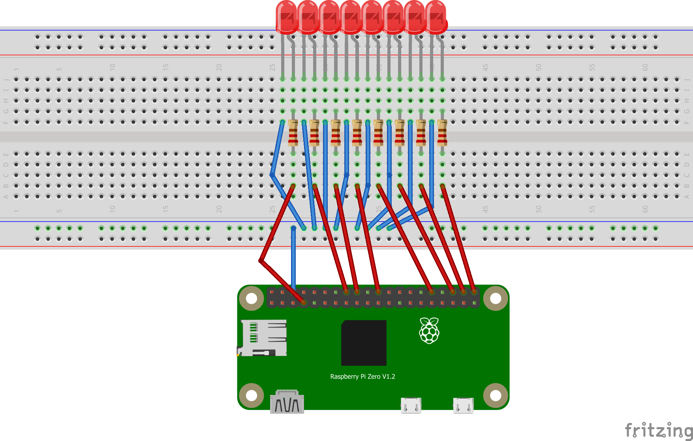

## Raspberry Pi eight LED modes

### Requirements: :airplane:
This program contains several lighting modes using Raspberry Pi (any type, but tested on Zero) and following connection:

### Modes (list is not yet complete) :construction:
- [ ] allon - Turns all LEDs on

    :red_circle::red_circle: :red_circle: :red_circle: :red_circle: :red_circle: :red_circle: :red_circle:
    
- [ ] alloff  - Turns all LEDs off (used mostly in testing)

    :black_circle: :black_circle: :black_circle: :black_circle: :black_circle: :black_circle: :black_circle: :black_circle: 
    
- [ ] kitt - Lights LEDs from center to the edges like in Knight Rider

    :black_circle: :black_circle: :black_circle: :red_circle: :red_circle: :black_circle: :black_circle: :black_circle: 
    
    :black_circle: :black_circle: :red_circle: :black_circle: :black_circle: :red_circle: :black_circle: :black_circle: 
    
    :black_circle: :red_circle: :black_circle: :black_circle: :black_circle: :black_circle: :red_circle: :black_circle: 
    
    :red_circle: :black_circle: :black_circle: :black_circle: :black_circle: :black_circle: :black_circle: :red_circle:
    
    
### Author: :octocat:
@miskopo